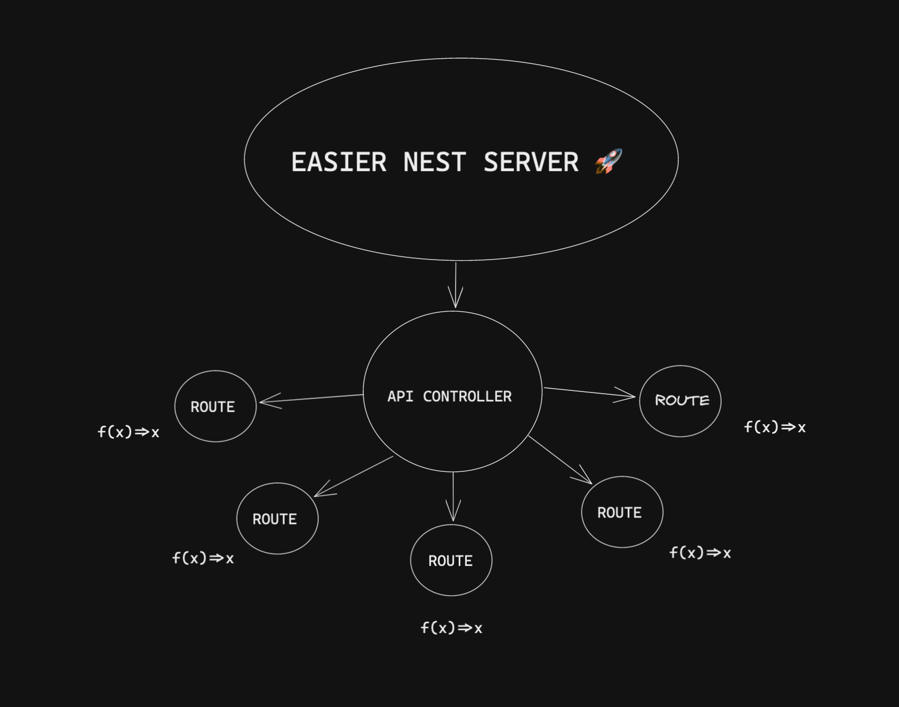

# Easier Nest Server

## Description

An attempt at simplifying the API route creation of [Nest](https://github.com/nestjs/nest). Focus on writing handler functions instead of providers. This model is friendly for people more comfortable with functional programming than OOP.

## The Design

Nest servers are generally built in an object oriented way. The 3 core components of Nest servers are:

- [Controllers](https://docs.nestjs.com/controllers)
- [Providers](https://docs.nestjs.com/providers)
- [Modules](https://docs.nestjs.com/modules)

In this project, we keep 1 Controller `ApiController` that manages all api routes which are simple handler functions. These handler functions are replacements for `Providers`.

### ApiController

Instead of writing many controllers for many routes, we rely on one controller for all routes. Also, Nest ships with [Decorators](https://docs.nestjs.com/controllers#full-resource-sample) to define different CRUD operations in controllers. In this case, we rely on 1 of those Decorators - the `@All()` Decorator which will handle all CRUD operations for a given route. This way, we offload the conditional logic to the handler function.

```ts
// src/api/api.controller.ts

import { All, Controller, Req, Res } from '@nestjs/common';
import { routeConfig as helloConfig } from './routes/hello/hello';
import { routeConfig as helloParamConfig } from './routes/hello/nameParam';

/**
 * This is the core controller for API routes. To create routes for the API,
 * simply create a new route under the routes folder, create an async
 * handler function, and export a routeConfig object that contains the path for the route
 * and the handler function. Import it into this file and add it under the
 * ApiController class.
 */

@Controller('api')
export class ApiController {
  @All(helloConfig.path)
  async executeHelloHandler(@Req() req, @Res() res) {
    return helloConfig.handler(req, res);
  }

  @All(helloParamConfig.path)
  async executeHelloNameHandler(@Req() req, @Res() res) {
    return helloParamConfig.handler(req, res);
  }
}
```

In the `ApiController`, we're importing `routeConfig` objects from route files. Here are the two routes used:

```ts
// src/api/routes/hello/hello.ts

async function handler(req, res) {
  if (req.method === 'GET') {
    return res.json({ url: req.url });
  }
}

export const routeConfig = {
  path: '/hello',
  handler: handler,
};
```

```ts
// src/api/routes/hello/nameParam.ts

import axios from 'axios';

async function handler(req, res) {
  if (req.method === 'GET') {
    const { data } = await axios.get(
      `https://api.github.com/users/${req.params.name}`,
    );
    return res.json(data);
  }
}

export const routeConfig = {
  path: '/hello/:name',
  handler: handler,
};
```

## Installation

```bash
$ yarn install
```

## Running the app

```bash
# development
$ yarn start

# watch mode
$ yarn start:dev

# production mode
$ yarn start:prod
```

## Test

```bash
# unit tests
$ yarn test

# e2e tests
$ yarn test:e2e

# test coverage
$ yarn test:cov
```
